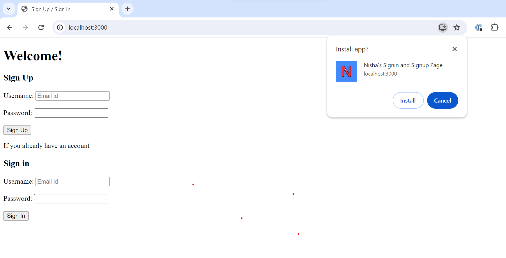

# Steps to install

```
npm install
npm install express body-parser
```
# Steps to run

```
node app.js
```
Open http://localhost:3000 in your browser to see the website.

To make a PWA,
Have included manifest.json file and icon image to make the website installabale. pwa_screenshot.png file shows how the app can be installed.


Have also used service worker to cache index.html file
Used Google Lighthouse to validate whether the app satisfies the criteria of a PWA.
Reference
https://blog.logrocket.com/how-to-build-a-progressive-web-app-pwa-with-node-js/

